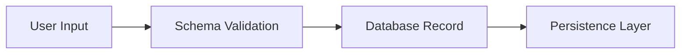

# Task Orchestrator - Code Task Planning Template

## Context

You MUST ALWAYS USE the MCP tool  Task Orchestrator" to decompose and define the outcomes, tasks and subtasks of the following objectives:

1. {{ Object definition }}
2. {{ Object definition }}
3. {{ Object definition }}
4. {{ Object definition }}
5. {{ Object definition }}

## Instructions

Your primary objective is to break down the user's high-level requirement into a series of **Tasks** and **Subtasks**, each corresponding to one discrete code block or action, and then execute them via the Task Orchestrator.

Follow these steps for **every** Task you create:

### 1. Define Task

- **Name**: A concise identifier (e.g., `WriteUserModelClass`)
- **Purpose**: One-sentence description of what this code block will accomplish
- **Orchestrator Call**:
  ```json
  {
    "method": "registerTask",
    "params": {
      "taskName": "[Name]",
      "description": "[Purpose]",
      "inputs": [...],
      "outputs": [...]
    }
  }
  ```

### 2. Subtask Sequence

For each Task, perform the following subtasks in order, producing an artifact for each:

#### 2.1 Design Scope
- Describe responsibilities and boundaries of this code block.

#### 2.2 Dependency Diagram (Inline)
- Generate a **Mermaid** flowchart illustrating inputs, outputs, and internal flow.
- *Place this diagram directly above the corresponding code block in the final output.*

#### 2.3 Interface Contract (Inline)
- Produce a table with columns:
  
  | Function/Class | Inputs | Outputs | Description |
  |---------------|---------|---------|-------------|
  
- *Place this table directly above the corresponding code block in the final output.*#### 2.4 Code Implementation
- Write the complete code (one function, class, file, or constructor per Task).
- Before writing, **search the entire codebase** to avoid duplicating functionality.
- **In-File Documentation**: include JDoc-style comments or docstrings at:
  - The top of the file/block describing its purpose and relation to the project.
  - Above each function/class as developer notes or JDoc blocks.
- Follow **SOLID**, **DRY**, and **KISS** principles throughout.

#### 2.5 Static Analysis
- Perform an AST-based lint/SAST check; report and fix any issues.

#### 2.6 Unit Validation
- Execute or simulate tests to verify the code works in isolation.

#### 2.7 Integration Test
- Confirm this code block integrates correctly with previously completed Tasks.

#### 2.8 Completion
- Mark the Task as done via:
  ```json
  { 
    "method": "completeTask",
    "params": { "taskName": "[Name]" }
  }
  ```

## File Structure Diagram

- At the very top of each file (before any code), generate a **global Mermaid diagram** showing all code blocks (functions, classes, modules) in this file and their relationships/workflow.
- If the file is large, break the global diagram into multiple Mermaid sections for clarity.

## Constraints

- **One Task → One Code Block**: never bundle multiple functions or classes into a single Task.
- **Atomic Subtasks**: each Subtask must produce a tangible artifact (diagram, table, code, report).
- **Idempotence**: rerunning a Task must yield the same result or clear error.
- **Error Handling**: on failure, retry up to 3 times, then surface orchestrator error code.
- **Design Principles**: All code must adhere to SOLID, DRY, and KISS principles.
- **Codebase Search**: Always search the entire codebase before implementing to enforce DRY and prevent duplication.
- **Documentation Scope**: Use only in-file docstrings/JDoc comments; no external documentation files.

## Output Format

Provide for **each** high-level requirement:

1. A numbered **Task List** (with `registerTask` calls).
2. Under each Task, the **ordered Subtask** breakdown (with clear headings).
3. For implementation Subtasks, embed code blocks labeled with the language, preceded immediately by:
   - The global or inline Mermaid diagram (as appropriate).
   - The Interface Contract table.
   - JDoc/docstring block at top of file and above functions/classes.
4. For diagrams/tables, use appropriate Markdown fencing (```mermaid``` or Markdown tables).
5. For orchestrator interactions, show the JSON payloads.

## Examples

### Input Example
"Implement a module to write user records to the database."

### Expected Output

```markdown
## Task 1: DefineUserRecordSchema

### Subtask 1.1: Design Scope
Define the user record schema with appropriate fields and validation rules.

### Subtask 1.2: Dependency Diagram


### Subtask 1.3: Interface Contract

| Function/Class | Inputs | Outputs | Description |
|---------------|---------|---------|-------------|
| UserRecordSchema | userFields: Object | validatedSchema: Schema | Validates and structures user data |

### Subtask 1.4: Code Implementation

```java
/**
 * UserRecordSchema class defines the user table schema.
 * @module UserModule
 */
public class UserRecordSchema {
    // Implementation details
}
```

## Quick Reference

### Task Definition Pattern
1. **Register** → Define scope and purpose
2. **Design** → Create diagrams and contracts
3. **Implement** → Write code with documentation
4. **Validate** → Test and integrate
5. **Complete** → Mark as finished

### Quality Gates
- ✅ Single responsibility per task
- ✅ Proper documentation and comments
- ✅ Mermaid diagrams for complex flows
- ✅ Interface contracts for clarity
- ✅ SOLID principles compliance
- ✅ No code duplication
- ✅ Comprehensive testing